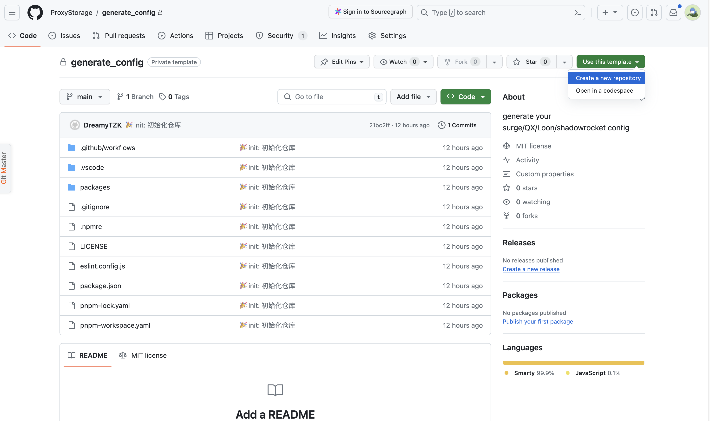
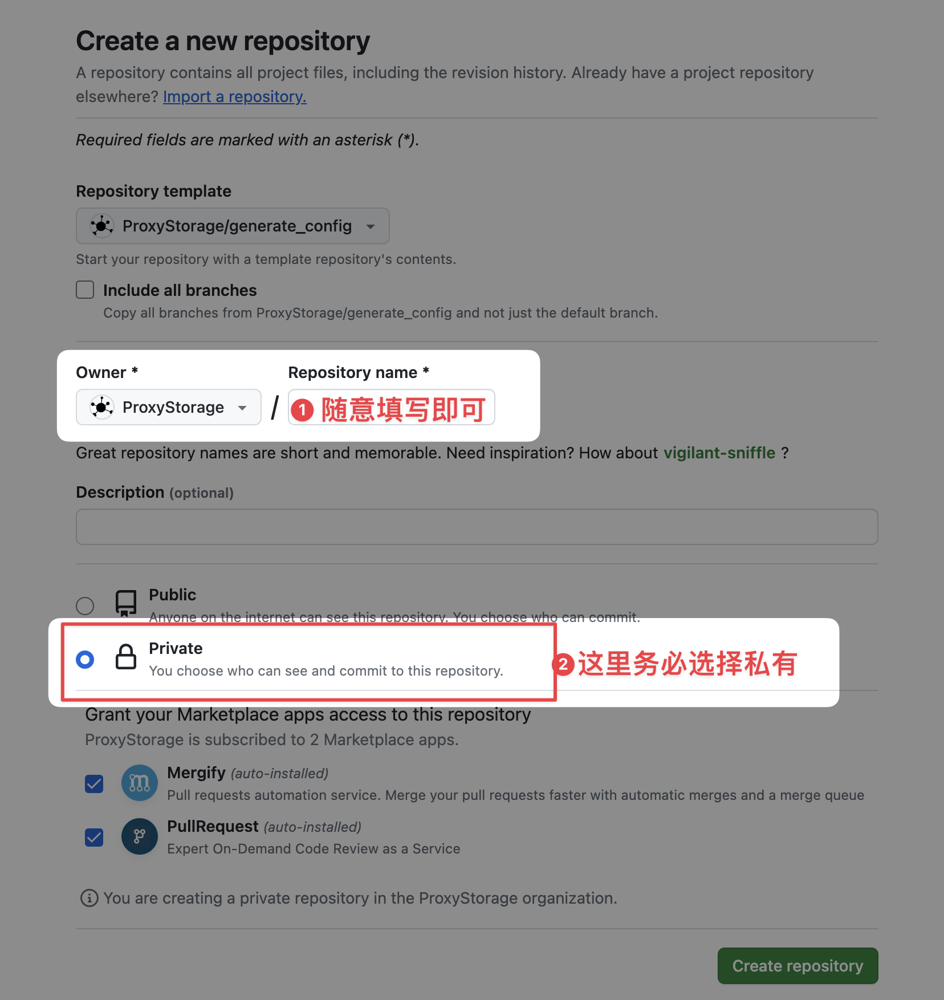
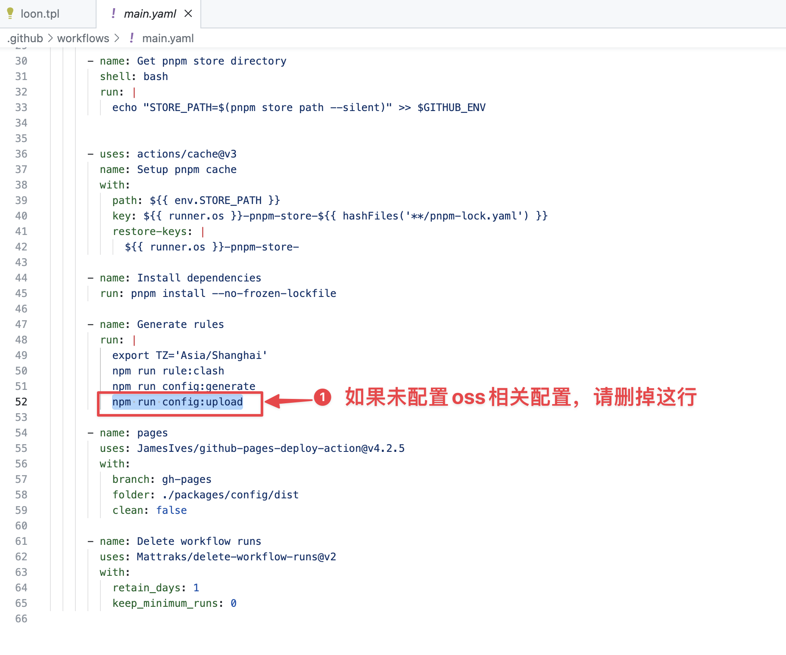
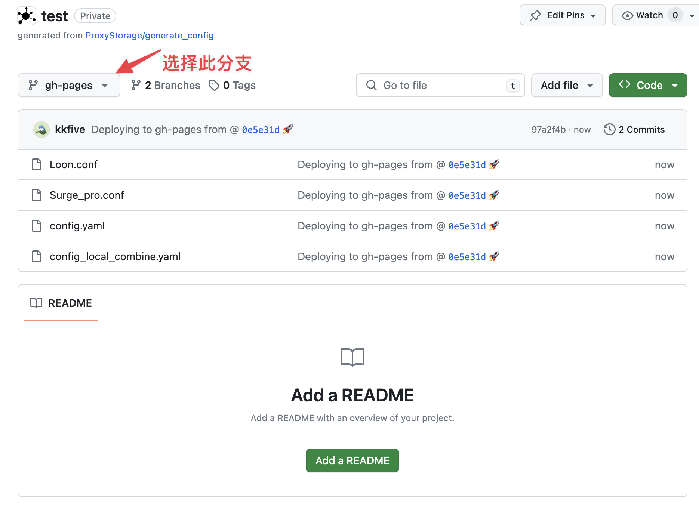
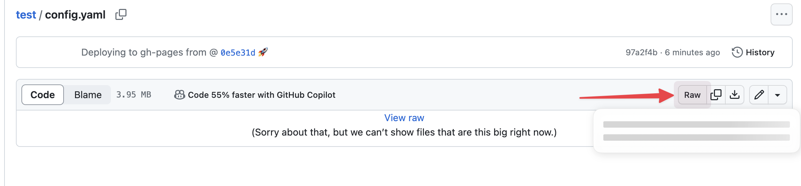

## 介绍

为了能够像pro一样编写出多款代理工具的配置，因此我创建了这个项目。目的也很简单：像pro一样，拥有自己的配置文件。

## 说明

此项目实际是[For-Own-Use](https://github.com/ProxyStorage/For-Own-Use)项目的改进版本。在早些时候，为了能够统一配置我是选择手动维护几份配置文件，但两份及两份以上配置后，便会显得越发难以维护。例如：

- 规则发生变化：如果是引用外部规则也还好，但是如果有自己的规则就难以维护了。除非将其上传并使用其静态链接
- 代理节点的问题：这个问题我目前仅在surge for mac遇到过，因为当时使用的是[sub-store](https://github.com/sub-store-org/Sub-Store)进行管理的节点，但是surge for mac会遇到一个问题，就是经常会节点消失，以至于无法访问github，进而导致无法更新sub-store的脚本，也就导致了无法更新节点。（虽然通过将substore脚本发布npm解决了此问题，但同步脚本及发布始终不是很顺畅）
- 规则名称问题：由于一些原因，在配置文件中修改规则名称是件相当费事的事情，也很难把多个配置文件的规则名称统一。
- 节点订阅问题：由于一些原因，公司用的电脑是Windows，因此sub-store这些也无法使用（虽然现在可以部署到服务端，但我也懒得折腾了），也就又遇到问题，我该如何与iOS端的代理工具配置尽可能保持同步

为了解决以上问题，我最终选择了surgio来解决这些问题，不过同样的也会存在一些问题：
- 配置文件难以书写，因为是模板且没有代码高亮，因此写起来是件很痛苦的事情
- 订阅问题，我并不想在服务端跑一个服务来生成订阅，因此只能选择上传到githubPage或者阿里云OSS，或者其他。就会导致节点/规则更新不及时的问题。但是可以通过actions来适度解决此问题。

此项目依赖于[surgio](https://surgio.js.org/),如果你想像我一样生成配置，因此你不得不去了解一下surgio。

**另外，此项目一些操作不适合手机端用户，因此想要像pro一样，那么一台电脑是必不可少的。**

## 快速开始


### 1. 使用模板新建项目

> 本仓库名称可能与图中仓库名称不一致，但这不是问题





### 2. 修改为自己的配置

clone到本地也好，使用在线的codespaces也好。总之打开项目，修改配置。

> 这部分如果不明白，可以参考surgio的官方文档。*/packages/config*就是一个surgio的项目

1. 在`/packages/config/provider`文件中新建自己的机场provider

2. 修改`/packages/config/surgio.config.js`模板及oss的配置

3. 如果你并未填写oss相关配置，请到`.github/workflows/main.yaml`中删除或注释upload相关的操作

   

   

4. 提交文件到GitHub

### 3. 配置actions


### 4. 查看产物



如果一切顺利，这在gh-pages分支即可看到构建的产物。如果你配置的阿里云oss，那么阿里云的对应的目录中也会存在此文件。

## 关于更新

默认情况下，每天凌晨3点左右会自动运行，当然你也可以自行更改。详情请自行查看GitHub Actions相关文档，这里不进行赘述。

建议上传至阿里云oss，因为这样配置文件的地址是固定的，每天/或定时可重新下载远程配置文件。当然如果使用GitHub Pages也是可以的，这样则有两种更新订阅链接的方式

- 手动点击原文件则会跳转到源文件地址

  

- 利用[Peng-YM/github-private-repo.js](https://raw.githubusercontent.com/Peng-YM/QuanX/master/Rewrites/GithubPrivate/github-private-repo.js)脚本可以实现自动添加token。（仅适用于仅Loon & Surge可用）

- 画饼：后续会考虑同步一份到gist

## 关于规则

其中包含了我个人使用的分流规则，**但是这并不适合所有人，这并不适合所有人，这并不适合所有人**，因此你可能需要按你自己的想法进行配置。

### 公共分流

例如一些公开的分流地址，例如bilibili等，这些规则可以随意在GitHub中找到，因此这种你完全可以选择使用互联网连接地址。以surge为例子

```surge
# 哔哩哔哩
RULE-SET,https://raw.githubusercontent.com/blackmatrix7/ios_rule_script/master/rule/Surge/BiliBili/BiliBili.list,{{ customParams.proxyName.BiliBili }}
```

### 私有分流

当然还有一些比较私人的分流地址，并不希望放在互联网上，也不愿意为了分流在单独新建一个私有仓库。此时就可以使用本地分流文件进行导入，以surge为例子

```surge
# 公司业务域名
{{ snippet("../../../packages/rule/snippet/company_rules.tpl").main(customParams.proxyName.Company) }}
```

以上含义指使用`company_rules.tpl`来对应`Company`的规则。

然后去`/packages/rule/snippet/company_rules.tpl`文件编辑自己对应的规则即可。

这部分规则会直接写入配置文件。

## 关于配置文件的模板

这个与我个人有关系，我个人使用的是surge，但由于特殊原因，公司只能使用Windows电脑，因此我个人大概率只会维护这两个软件的规则，日后看情况会补充其他的。不过这并不影响你使用此仓库，此仓库的目的只是为了告诉你一种做配置文件的思路，并不是为了让你直接使用，或全盘照抄。
